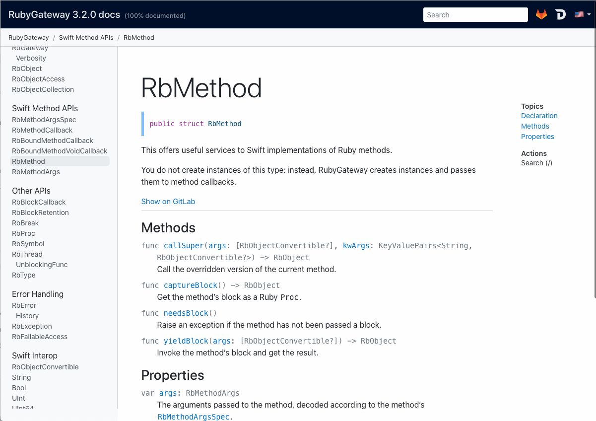
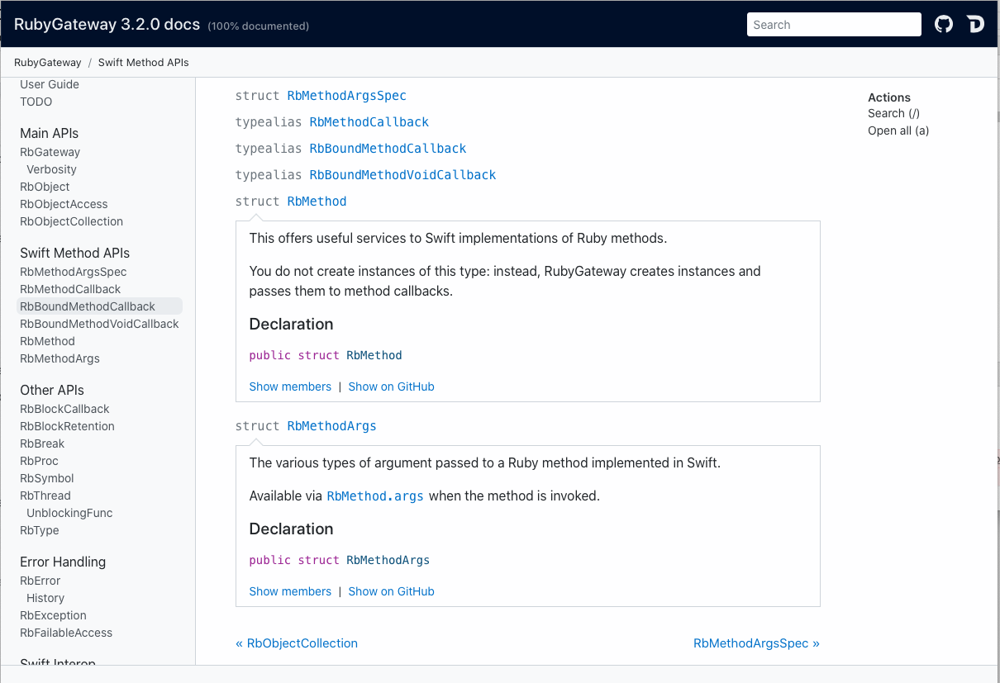
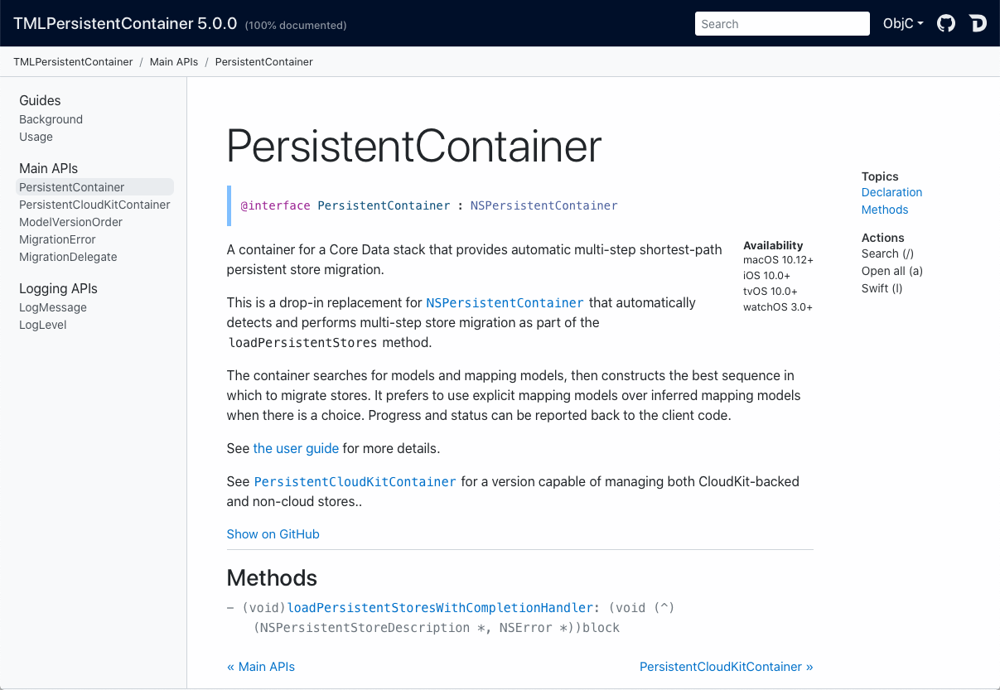
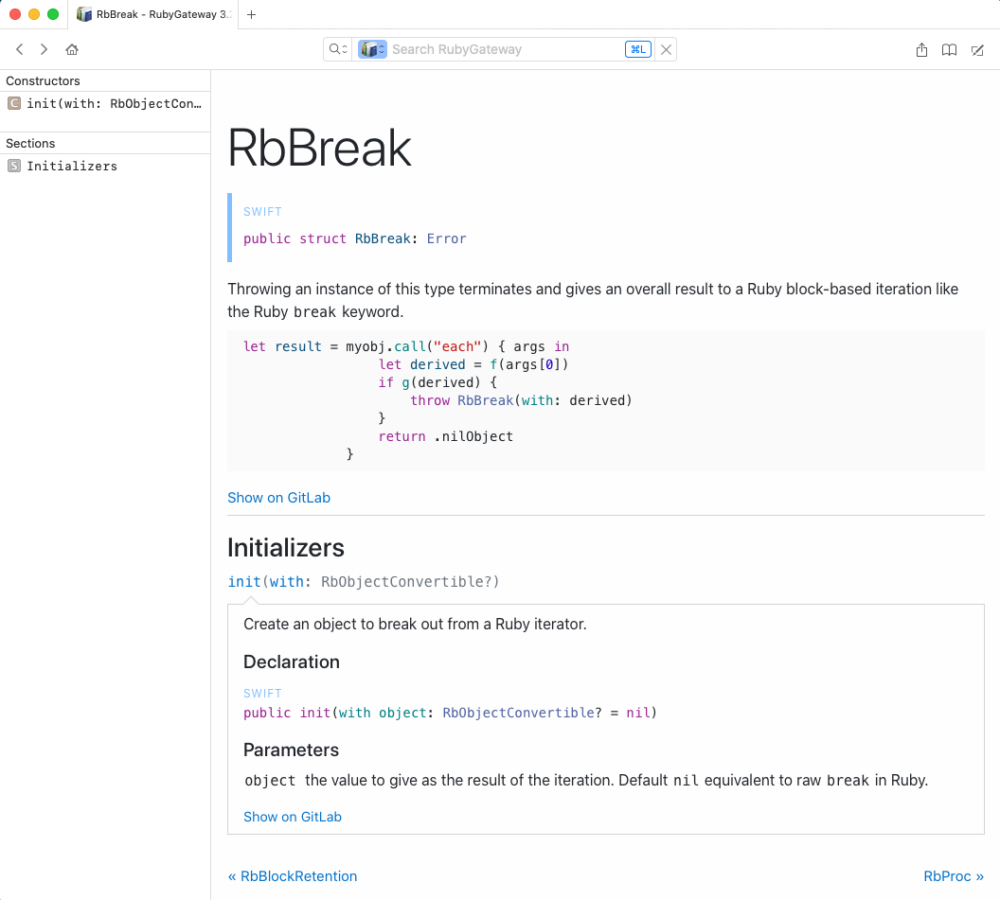

Bebop: [Jazzy](https://github.com/realm/Jazzy) API docs generation with extra
bits.  There are bells _and_ whistles.
* Swift/Objc/Both everywhere
* Localize everything, doc comments to images
* Input SPM/Xcodeproj/Podspec/binary .swiftmodule, output html/dash docset/markdown, various flavors of json
* Multi-module/multi-pass
* Commonmark + extensions + custom extensions, KaTeX
* Apple/Jazzy/Hybrid/Custom layout 
* Flexible web theme, keybinds, more navigation
* Integrate with other docsets, Docc sites, online/inline Apple docs, github/gitlab/bitbucket/custom
* Mostly compatible with Jazzy CLI / config file / themes -- migration aide+
* Experiment with monolithic project and heavy dependencies

### Install
macOS:
```shell
brew install johnfairh/bebop/bebop/
```
Builds from source, takes a while.

Linux, approximately:
```shell
git clone git@github.com:johnfairh/Bebop.git
apt-get install libsqlite3-dev libsass0 libsass-dev
make install
```

### Examples

  

  
