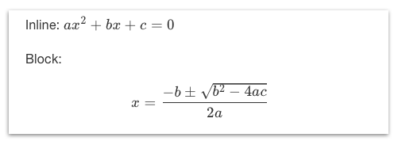

# Markdown Extensions

Markdown is processed with [CMark-GFM](https://github.com/github/cmark-gfm),
with all extensions enabled.  Bebop provides additional extensions.

Xcode Quick Help uses a CommonMark-derived renderer -- be aware of differences
when writing doc comments.

See the [Commonmark spec](https://github.github.com/gfm/) and the
[Xcode Markup Formatting Reference](https://developer.apple.com/library/content/documentation/Xcode/Reference/xcode_markup_formatting_ref/) to get started.

## CMark GFM extensions

* [Tables](https://github.github.com/gfm/#tables-extension-)
* [Task lists](https://github.github.com/gfm/#task-list-items-extension-)
* [Strikethrough](https://github.github.com/gfm/#strikethrough-extension-)
* [URL autolinks](https://github.github.com/gfm/#autolinks-extension-)
* [Footnotes](https://www.markdownguide.org/extended-syntax/#footnotes)

## Bebop extensions

* [Definition autolinks](#definition-autolinks)
* [Callouts](#callouts)
* [Syntax highlighting](#syntax-highlighting)
* [Math](#math)
* [Image link rewriting](#image-link-rewriting)
* [General link rewriting](#general-link-rewriting)
* [Image scaling](#image-scaling)
* [Localization](#localization)
* [Description lists](#description-lists)

### Definition autolinks

Bebop tries to replace an identifier written in backticks to a link to that
identifier.  For example:
* \`MyClass\` - a link to documentation for `MyClass`.
* \`MyModule.MyClass\` - a link to documentation for the `MyClass` in
  `MyModule`.
* \`MyClass.method(param1:)\` - a link to documentation for that method.
* \`MyClass.method(...)\` - shortcut syntax for the same thing.
* \`method(...)\` - shortcut syntax to link to `method` from the documentation
  of a declaration in (a) the _same_ scope or (b) the _nested_ scope.  If this
  results in the wrong link because you have multiple declarations sharing a
  name at different nesting levels then use the fully qualified name instead.
* \`[MyClass method1]\` - a link to an Objective-C method.
* \`-[MyClass method2:param1]\` - a link to another Objective-C method.

Bebop understands Apple's DocC-style links too, for example:
* \`\`MyClass/method(param1:)\`\` - a link to the documentation for that method
  that appears as just `method(param1:)` in the rendered page.
* \`\`<doc:method(_:)-e873>\`\` - a link to a specific overload of `method(_:)`.
  Bebop can't tell which overload you intend and links to the first one.

Bebop always searches the docs being built for matches.

By default, on macOS, it also tries to link identifiers to the Apple docs on
`developer.apple.com`.  Disable this with `--no-apple-autolink`.  Post Xcode
12.5 this is best-effort based on a static config file.

Autolink to other Jazzy/Bebop or Docc online doc sites with `remote_autolink`.

### Callouts

Bebop recognizes and formats callouts as defined in the
[Xcode docs](https://developer.apple.com/library/archive/documentation/Xcode/Reference/xcode_markup_formatting_ref/Attention.html#//apple_ref/doc/uid/TP40016497-CH29-SW1)

It supports all the Xcode Quick Help callouts as well as `- example:` and
`- see:`.  It also supports custom callouts, for example:
```markdown
- callout(Special Notice): Don't touch your face!
```

Bebop also supports Apple's DocC-format callouts, for example:
```markdown
> Experiment: What goes up must come down.
```

### Syntax highlighting

Write the language to use after the triple-backtick that introduces a code
block:
````markdown
```language
My language
```
````
Bebop uses [PrismJS](https://prismjs.com) for highlighting.  See the [list of
languages](https://prismjs.com/#supported-languages) and
[some more details](misc.md).

If you omit the language name then this defaults to Swift or Objective-C.  If
the default is wrong you might be able to influence it with `--default-language`
but it's better to just write it in your source.

### Math

Bebop renders equations written in LaTeX embedded in your markdown:
* `` `$equation$` `` renders the equation in an inline style.
* `` `$$equation$$` `` renders the equation in a display style, centered on a
  line of its own.

For example, the markdown:
```markdown
Inline: `$ax^2+bx+c=0$`

Block: `$$x={\frac {-b\pm {\sqrt {b^{2}-4ac}}}{2a}}$$`
```
..renders as:



Math support is provided by [KaTeX](https://katex.org).

### Image link rewriting

Use `--media` to include image files in your documentation.

Write the link to them as though the file was in the current directory and
Bebop will resolve it.

For example if your file is called `pretty.png`:
```markdown

```

Bebop also supports the case where you want to include this image in quick help
docs, assuming Xcode eventually unbreaks that feature, or you want to view the
original markdown document directly.  The steps are:
1. Host the image somewhere with a URL.
2. Write the full URL in your markdown ``
3. Pass `--rewrite-link-urls https://my.domain` as well as
   `--media pretty.png`.  Then Bebop will rewrite any links that begin with
   `https://my.domain` _and_ point to a file matching media.

### General link rewriting

Same as for images except general links `[text](url)` - applies to any files
supplied with `--media` and any guides supplied with `--guides`.

Use 'README.md' as the URL to link to the Readme / top-level index page, for
example:
```markdown
See [the README](README.md) for more details.
```

### Image scaling

To set the pixel size of an image use syntax like this:
```markdown

```

To set the pixel size of an image and request scaling:
```markdown

```

### Localization

All markdown content and media an be localized [one way or another](localization.md).

### Description lists

Bebop supports Apple DocC-format description lists, for example:
```markdown
- term Term 1: Description 1.
- term Term 2: Description 2.
- term Term 3: Description 3.
```
